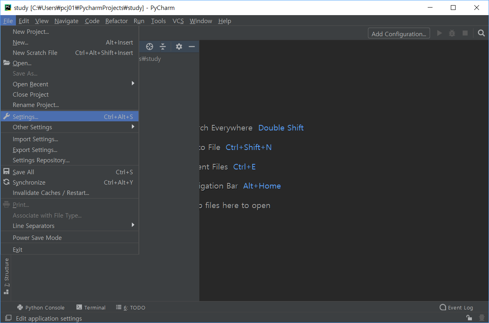
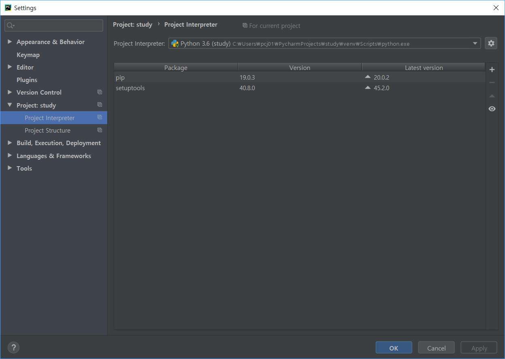
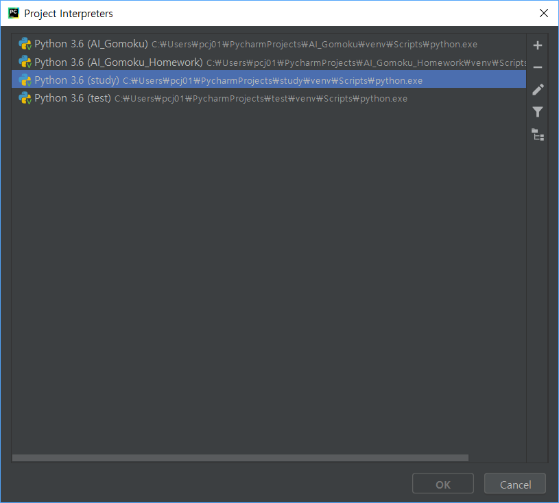
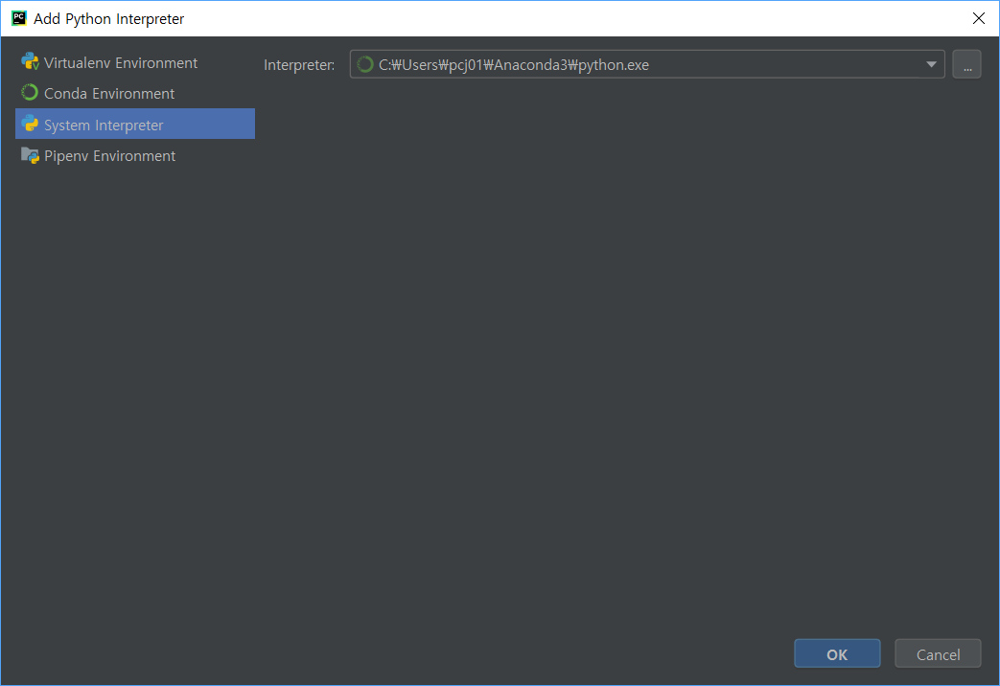
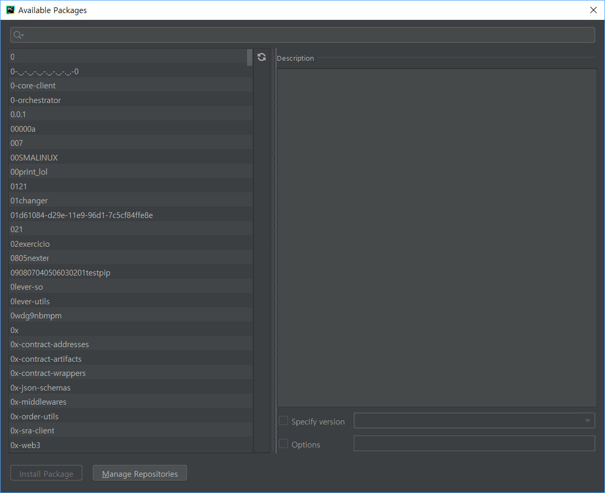

# Python과 PyCharm 관련 내용

## PyCharm 관련 내용

### PyCharm Virtual environment

파이썬으로 프로젝트를 진행할 경우 프로젝트마다 설정이나 패키지 설치가 다를 수 있다. 각 프로젝트 별로 구분된 설정과 패키지 설치를 위해서 가상환경(Virtual Environment)를 사용할 수 있다.

File -> Setting

'Project : 프로젝트명' 탭 클릭. 이 화면에서 해당 프로젝트의 인터프리터 설정, 패키지 설치 및 관리를 진행할 수 있다.

인터프리터 설정 오른쪽 톱니파퀴를 클릭하면 다음과 같은 화면을 볼 수 있다. 해당 프로젝트에 설정할 인터프리터를 설정한다. 이전에 만들어놨던 다른 프로젝트의 가상환경도 선택할 수 있는것 같다.

가상환경이 아니라 시스템 인터프리터로 글로벌한 환경을 사용할 수 있는 것 같다.

톱니바퀴 아래 + 버튼을 이용하면 해당 가상환경에 새로운 패키지를 설치할 수 있는 화면이 나타난다. 여기서 새로운 패키지 설치가 가능하다.
